# DEMO CENTER

> Catalogo dei progetti, demo, simulatori e piattaforme.

> [!NOTE]
> **Video:** i video originali sono ospitati su SharePoint/Stream e **non sono inclusi** come file.
> Qui sono riportati con il nome file e, dove disponibile, il fotogramma di anteprima.
> Per i video veri scaricali dalla pagina SharePoint e aggiungili alla cartella `videos/`.

---

## Indice

| # | Progetto | Tag principali |
|---|----------|----------------|
| 1 | [CTE-Spazio](#1-cte-spazio) | `#training` `#seriousGaming` `#space` |
| 2 | [STEALTH](#2-stealth) | `#ROS` |
| 3 | [ACHILE](#3-achile) | `#DIS` `#gStreamer` `#digitalTwin` |
| 4 | [LATACC](#4-latacc) | `#DIS` `#SAPIENT` |
| 5 | [FEDERATES](#5-federates) | `#HLA` `#CrowdModeling` |
| 6 | [BEEYONDERS](#6-beeyonders) | `#PathPlanning` `#A*` |
| 7 | [EDI 4.0](#7-edi-40) | `#BIM` `#Asset` `#AIM` |
| 8 | [SBS](#8-sbs) | `#BIM` `#Asset` `#AIM` |
| 9 | [AIM SMARTARGETS](#9-aim-smartargets) | `#BIM` `#Asset` `#AIM` |
| 10 | [CTE](#10-cte) | `#VR` `#DigitalTwin` `#Robot` `#latenza` |
| 11 | [EFESTO](#11-efesto) | `#BIM` `#Asset` `#Infrastrutture` |
| 12 | [HealthyCity](#12-healthycity) | `#BIM` `#Asset` `#Health` `#Sicurezza` |
| 13 | [BIM + VR (mobile/AR)](#13-bim--vr-mobilear) | `#BIM` `#AR` `#SIMULATION` |
| 14 | [PAVE-SCAN (Tesi AR)](#14-pave-scan-tesi-ar) | `#AR` `#SIMULATION` `#ROADMANAGEMENT` |
| 15 | [BIM + VR (web)](#15-bim--vr-web) | `#VR` `#SIMULATION` `#BIM` |
| 16 | [VR – Scenario Builder, Simulator & Training] | `#VR` `#UNITY` `#SIMULATION` `#SCENARIOBUILDER` |

---

## 1. CTE-Spazio

**Descrizione**
L'applicazione permette di effettuare il training di un operatore del Canadarm2 a bordo della ISS.
L'operatore è situato all'interno dell'ISS Cupola e non ha libertà di movimento. Lo scopo del training è addestrare l'operatore alla conoscenza della strumentazione legata al Canadarm e come usufruirne al meglio per operare il braccio.

Nel dettaglio, l'operazione da fare è agganciare un piccolo satellite con l'End Effector. Il simulatore fornisce una versione semplificata della strumentazione e dei controlli che comprende:

- 10 camere selezionabili
- schermata Armstat per il monitoraggio dei giunti del braccio
- gestione dei frame (sistemi di riferimento)
- 3 velocità selezionabili
- un sistema di controllo per articolazione (SHOULDER, ELBOW, WRIST) tramite singolo joystick (e non doppio come nella realtà)

Il simulatore mira ad essere più immersivo possibile, tramite l'uso del solo visore. Le mani vengono automaticamente riconosciute dalle camere dell'headset, per cui non servono i joystick. Per aumentare l'immersività, la simulazione prevede un accurato sound design della cupola e l'utilizzo di modelli 3D ad alto realismo per la cupola stessa e lo spazio esterno.

**Tag:** `#training` `#seriousGaming` `#space`

**Immagini**

| | | |
|---|---|---|
| 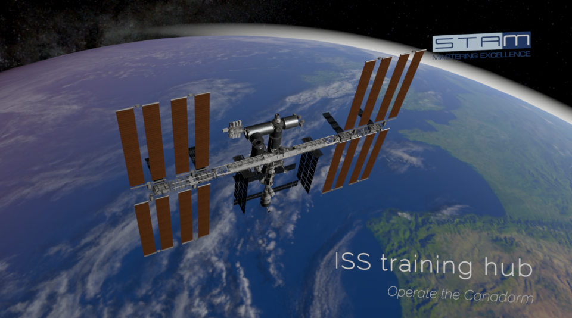 | 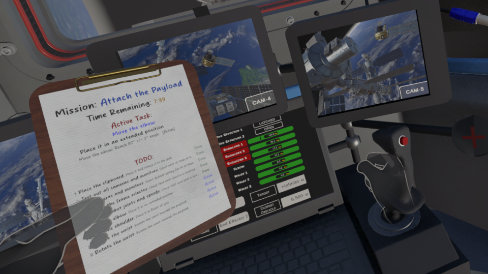 | 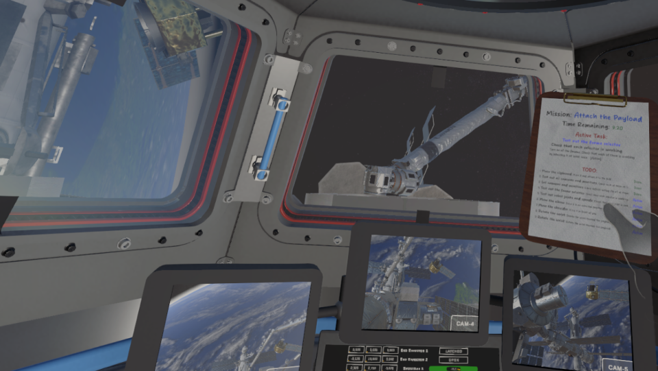 |

**Video**
- 🎬 `Intro_lowQuality_30fps`
- 🎬 `DemoCenter_CTESpazioDemoVideo_Cut` (durata 1:46) — anteprima:

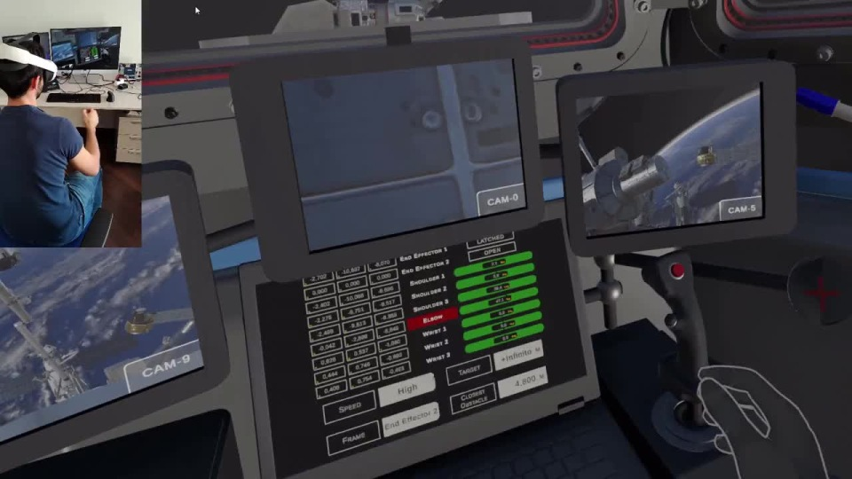

---

## 2. STEALTH

**Descrizione**
Il progetto STEALTH mira a simulare sciami di droni in situazioni di mancanza di informazioni GPS. Un insieme di droni reali e simulati si muove nello stesso scenario simulato e calcola il percorso basandosi su input di diverso tipo (prevalentemente immagini).

**Tag:** `#ROS`

**Link**
- 🔗 STEALTH - Defence Industry and Space

**Immagini**

| | |
|---|---|
| 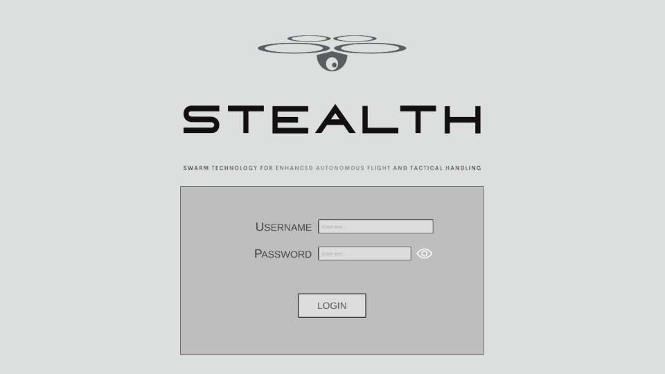 | 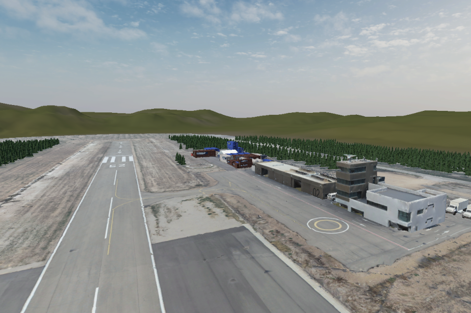 |

**Video**
- 🎬 `DemoCenter_StealthDemoVideo_Cut` — anteprima:

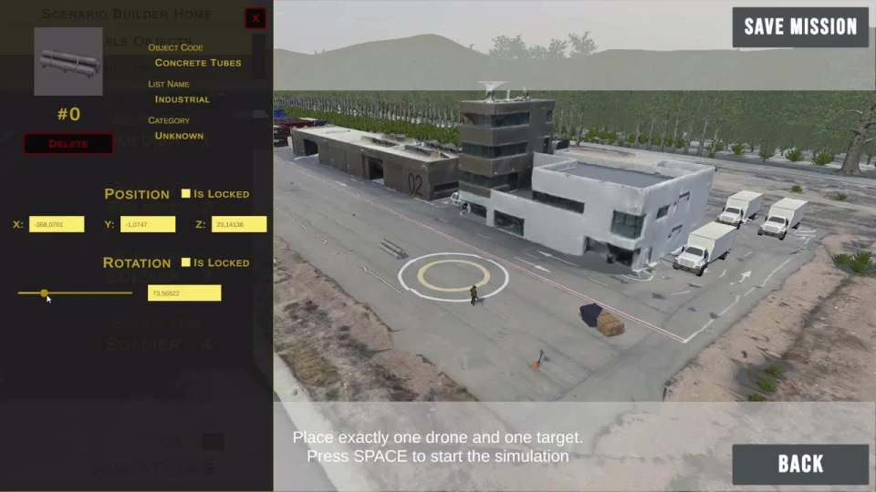

---

## 3. ACHILE

**Descrizione**
Il progetto ACHILE si dirama su due task separati:

- Il primo si pone l'obiettivo di sviluppare digital twin di oggetti e mappe da utilizzare in ambito militare.
- Il secondo utilizza lo SBS tool per simulare il movimento di un plotone in uno scenario reale, per poi comunicare la posizione tramite protocollo DIS. Nello scenario è presente un drone che fa streaming video tramite gStreamer.

**Tag:** `#DIS` `#gStreamer` `#digitalTwin`

**Link**
- 🔗 EDF21_Outcome_Template - Defence Industry and Space

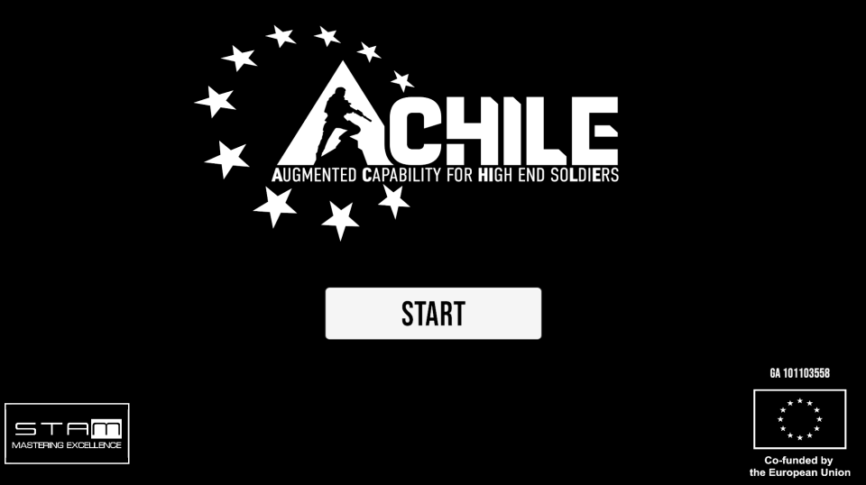

**Video**
- 🎬 `Low_Quality_DemoVideo` — task **T5.4**
- 🎬 `DemoCenter_AchileT83Demo` — task **T8.3**

| T5.4 | T8.3 |
|---|---|
| 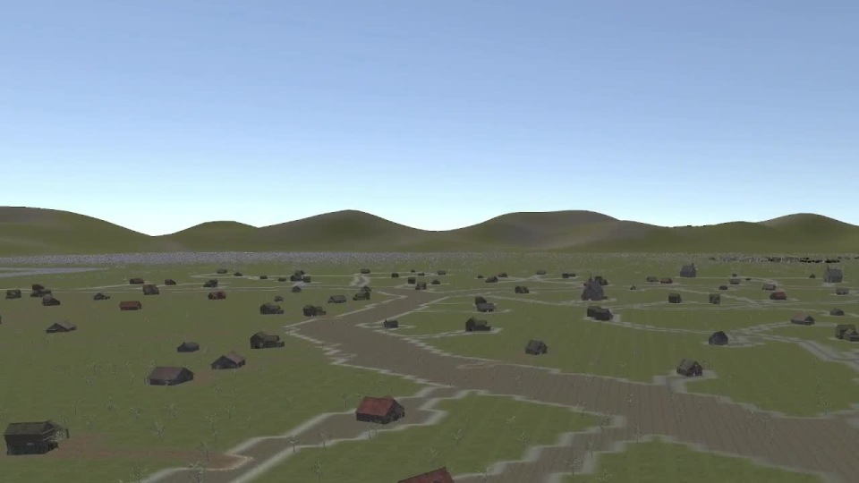 | 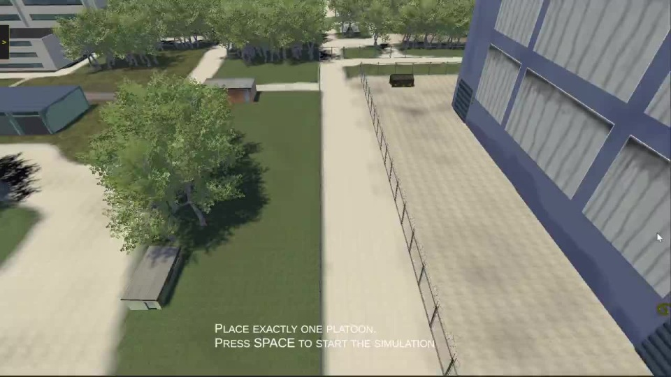 |

---

## 4. LATACC

**Descrizione**
Il progetto LATACC mira a simulare i processi di detection di un radar. Un numero non definito a priori di entità viene comunicato all'applicazione tramite protocollo DIS, e nel momento in cui il radar riconosce uno di questi invia un messaggio SAPIENT ad un'applicazione terza.

**Tag:** `#DIS` `#SAPIENT`

**Link**
- 🔗 LATACC - Defence Industry and Space

**Immagini**

| | |
|---|---|
| 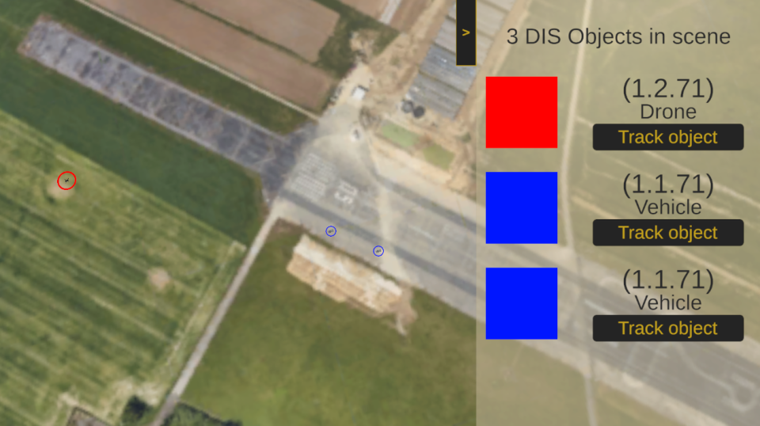 | 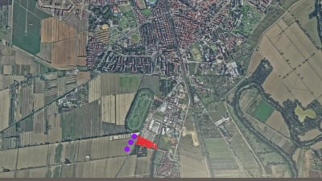 |

---

## 5. FEDERATES

**Descrizione**
Il progetto FEDERATES va a simulare un ipotetico scenario di operazione militare nell'area di Grosseto. Nello specifico, una piccola folla di 50 persone viene simulata all'avvicinarsi di tre veicoli militari. La simulazione dei veicoli avviene su un'applicazione terza, e la ricezione dei dati avviene tramite protocollo HLA. Lo stesso protocollo viene usato per pubblicare i dati relativi alla folla.

**Tag:** `#HLA` `#CrowdModeling`

**Link**
- 🔗 FEDerated Ecosystem of euRopean simulation Assets for Training and decision Support

**Immagini**

| | |
|---|---|
| 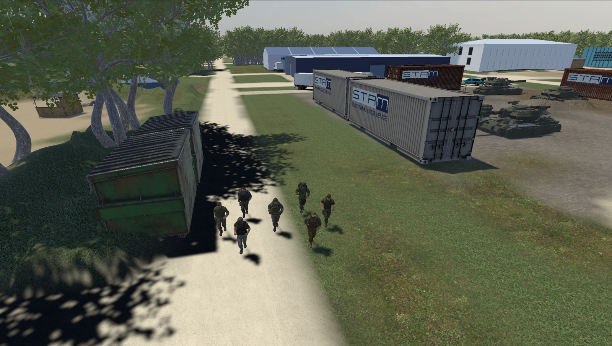 | 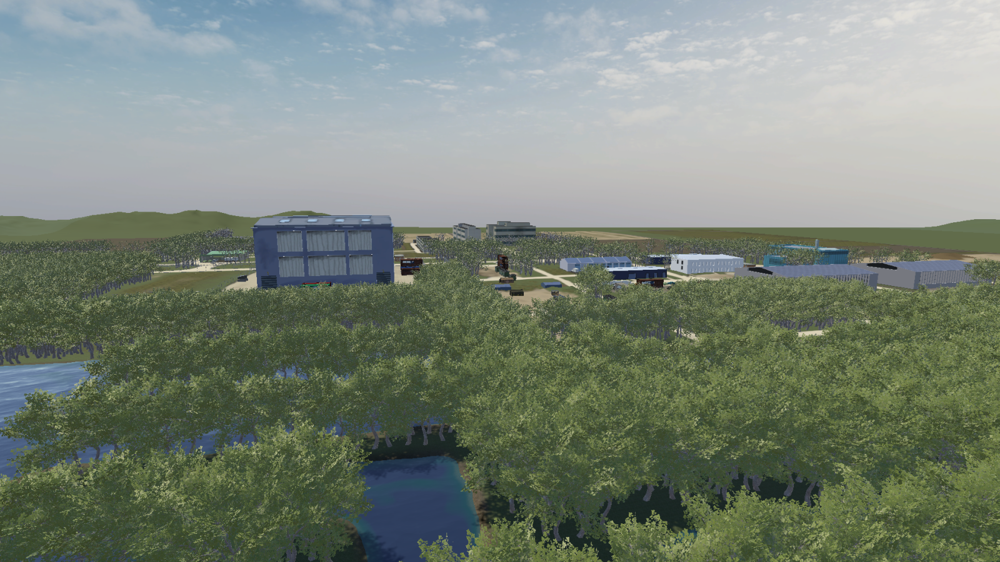 |

**Video**
- 🎬 `FederatesSimulationLowQuality` (durata 0:50)

---

## 6. BEEYONDERS

**Descrizione**
Il progetto BEEYONDERS va a modellare la traiettoria di veicoli a guida autonoma in un cantiere. Basandosi sui dati di spostamento delle persone nell'ambiente viene creata una traiettoria che trovi un compromesso tra la probabilità di incrociare un agente sul suo percorso e la distanza totale percorsa. Per fare questo, viene usata una variante "pesata" dell'algoritmo A*.

**Tag:** `#PathPlanning` `#A*`

**Immagini**

| | | |
|---|---|---|
| 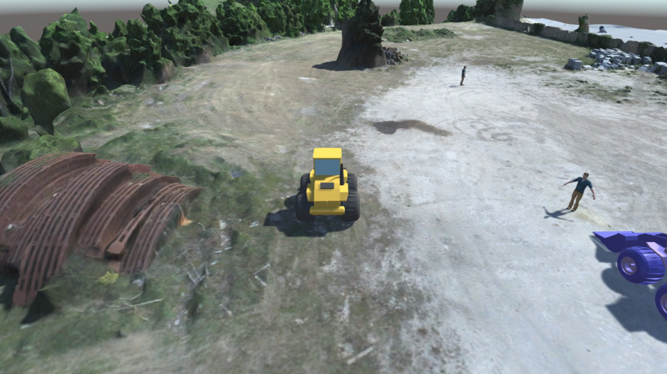 | 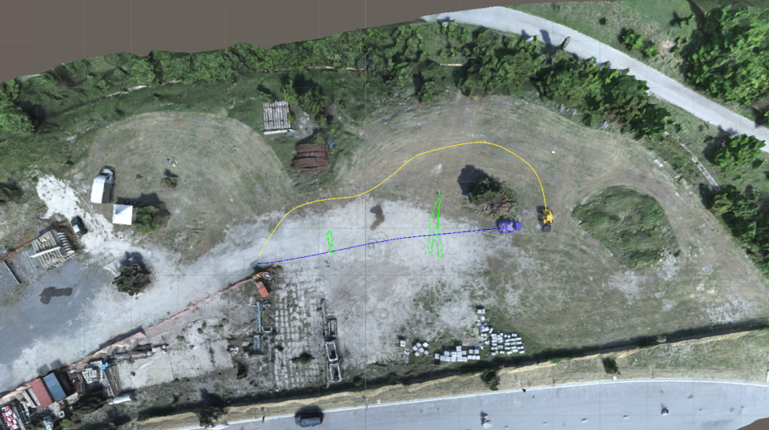 | 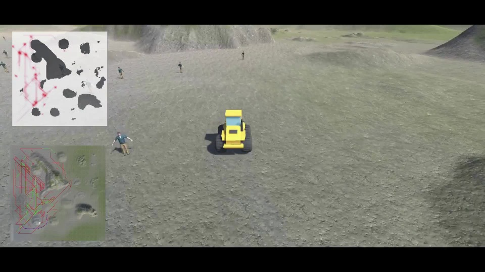 |

**Video**
- 🎬 `BeeyondersVideoOctober2024_LowQuality` (durata 1:25) — anteprima:

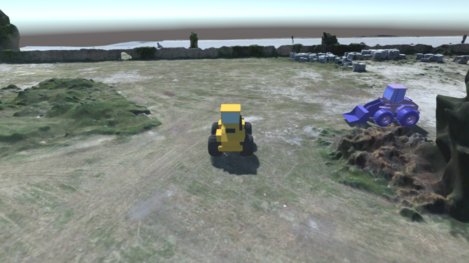

---

## 7. EDI 4.0

**Descrizione**
EDI 4.0 è una piattaforma per la digitalizzazione dell'intera filiera delle costruzioni che integra il BIM e la gestione delle funzioni e dei processi delle aziende della filiera in una logica di cooperazione operativa.

**Cliente:** Upgrading Services
**Tag:** `#BIM` `#Asset` `#AIM`

---

## 8. SBS

**Descrizione**
Estensione dell'applicativo EDI con la gestione BIM 5D e importazione dei dati di budget e di cronoprogramma anche tramite xls. Gestione BIA (Business Impact Analyzer) e integrazione del BIM con GIS.

**Cliente:** Upgrading Services
**Tag:** `#BIM` `#Asset` `#AIM`

---

## 9. AIM SMARTARGETS

**Descrizione**
Piattaforma digitale innovativa con lo scopo di facilitare e automatizzare la gestione integrativa delle informazioni (informazioni e modelli digitali, cosiddetti BIM) nel contesto operativo di ST, ossia in progetti architetturali di costruzione e infrastrutture.

Funzionalità del prototipo:

- upload, visualizzazione e navigazione del modello BIM;
- storicizzazione ed esposizione dei metadati rappresentanti il contenuto informativo del modello BIM;
- progettazione integrazione con dispositivi sul campo a livello di singolo modello per il monitoraggio dell'asset nella fase di esercizio;
- progettazione di funzionalità di visualizzazione dell'asset in un ambiente di VR (es. integrazione con framework di sviluppo VR quali Unity).

**Cliente:** SmarTargets
**Tag:** `#BIM` `#Asset` `#AIM`

---

## 10. CTE

**Descrizione**
Il progetto ha l'obiettivo di valutare le prestazioni della rete di comunicazione tra un simulatore sviluppato in Unity e un robot reale operante in ambiente fisico. L'interazione avviene in realtà virtuale (VR), dove viene visualizzata una replica digitale del robot (digital twin). La latenza di comunicazione viene misurata confrontando lo spostamento del modello virtuale nel simulatore con la risposta effettiva del robot in tempo reale.

Il progetto mira a testare la qualità della comunicazione all'interno di una rete 5G. Lo scenario presenta un robot industriale di tipo UR10 comandato tramite un'applicazione Unity, con la comunicazione che avviene tra il terminale Unity e un controllore Python connesso via cavo al robot.

Nell'applicazione Unity sono presenti sia la versione "virtuale" del robot che quella "reale": quest'ultima è basata sui dati in tempo reale del robot ed è rappresentata come un *ghost* (versione identica a quella virtuale ma semitrasparente). La discrepanza tra la versione "virtuale" (latenza nulla) e la versione "reale" (latenza dipendente dalla connessione 5G) permette di capire visivamente la latenza fornita dalla rete. Una dashboard 3D all'interno dell'applicazione consente inoltre di visualizzare lo storico preciso dei dati.

**Tag:** `#VR` `#DigitalTwin` `#Robot` `#latenza`

---

## 11. EFESTO

**Descrizione**
Piattaforma digitale innovativa di Asset Management, con lo scopo di facilitare e automatizzare la gestione delle informazioni di infrastrutture (es. ambito cantieristico e delle costruzioni) e dei singoli elementi che le compongono (asset).

Funzionalità attuali:

- censimento di contesti (es. cantieri, commesse, ecc.) e di asset (elementi interni al contesto);
- upload, visualizzazione e navigazione del modello BIM;
- documentale associato ad ogni contesto.

Direzioni future: gestione budget, cronoprogramma, accesso alle informazioni di budget e cronoprogramma tramite file IFC (BIM 5D).

**Cliente:** US
**Tag:** `#BIM` `#Asset` `#Infrastrutture`
**Possibili funzionalità future:** LCA, BIA (Business Impact Analyzer), VR/AR

---

## 12. HealthyCity

**Descrizione**
Piattaforma digitale per la visualizzazione di infrastrutture nel settore sanitario e l'accesso alla visualizzazione BIM 3D delle infrastrutture con relativi dettagli di specifici asset. La piattaforma permette agli utenti del progetto di visualizzare i modelli 3D delle infrastrutture e accedere dal singolo asset, attraverso una funzionalità di zoom-in, al modello e visualizzarlo sul modello stesso. Inoltre, da visualizzatore BIM, è possibile vedere i dati dell'asset e relativi documenti associati.

**Cliente:** LASIA
**Tag:** `#BIM` `#Asset` `#Infrastrutture` `#Health` `#Sicurezza`

---

## 13. BIM + VR (mobile/AR)

**Descrizione**
Il progetto ha realizzato un'applicazione mobile dedicata alla visualizzazione di modelli BIM in realtà aumentata, alla localizzazione e navigazione del modello in AR tramite posizionamento grazie a sistema di riferimento con codici QR, alla visualizzazione, modifica, salvataggio e versionamento dei dati contenuti nel BIM visualizzato.

**Tag:** `#BIM` `#AR` `#SIMULATION`

---

## 14. PAVE-SCAN (Tesi AR)

**Descrizione**
Il progetto ha realizzato un'applicazione mobile dedicata alla identificazione di buche sul manto stradale in realtà aumentata. Permette di aggiungere una buca, modificarla e visualizzarla in AR. Primo prototipo per il progetto PAVE-SCAN.

**Tag:** `#AR` `#SIMULATION` `#ROADMANAGEMENT`

---

## 15. BIM + VR (web)

**Descrizione**
Il progetto ha realizzato un'applicazione web dedicata alla visualizzazione di modelli BIM in realtà virtuale (3D), alla localizzazione e navigazione del modello in VR tramite posizionamento nello scenario, alla visualizzazione dei dati contenuti nel BIM visualizzato. Permette anche il caricamento, senza interfaccia, dei modelli BIM.

**Tag:** `#VR` `#SIMULATION` `#BIM`

---

## 16. VR – Scenario Builder, Simulator & Training

**Descrizione**
La soluzione vuole essere innanzitutto uno strumento di analisi e valutazione delle vulnerabilità degli spazi pubblici e di identificazione delle potenziali strategie di risposta. Inoltre, vuole abilitare servizi di formazione e sperimentazione di procedure di sicurezza per la progettazione delle risposte agli attacchi. Gli utenti target sono tutti coloro che gestiscono la sicurezza in qualsiasi tipo di spazio pubblico.

La soluzione presenta diverse caratteristiche assenti nei competitor, in particolare: la creazione di modelli VR/AR dell'ambiente costruito, la progettazione dinamica di asset di sicurezza di uno scenario, la creazione di scenari concernenti minacce e piani di attacco con configurazioni dinamiche, la possibilità di creare dinamiche di affollamento complesse, la simulazione dinamica di comportamenti della folla e dei piani di attacco progettati, la simulazione di configurazioni alternative degli stessi scenari e piani, e le funzionalità di serious gaming multigiocatore per mettere in pratica le procedure di sicurezza in prima persona.

Questa soluzione viene utilizzata per progettare scenari in spazi pubblici e di ambiente costruito (festival musicali, stazioni ferroviarie, siti religiosi), creare configurazioni multiple e personalizzate di piani di attacco e di elementi statici di sicurezza, simulare dinamicamente il comportamento della folla e formare tirocinanti della sicurezza all'interno degli scenari simulati.

**Tag:** `#VR` `#UNITY` `#SIMULATION` `#SCENARIOBUILDER`

**Video**
- 🎬 Scenario Builder — `SBS_Spirit.mp4`
- 🎬 Simulation — `SIM_Spirit.mp4`

---